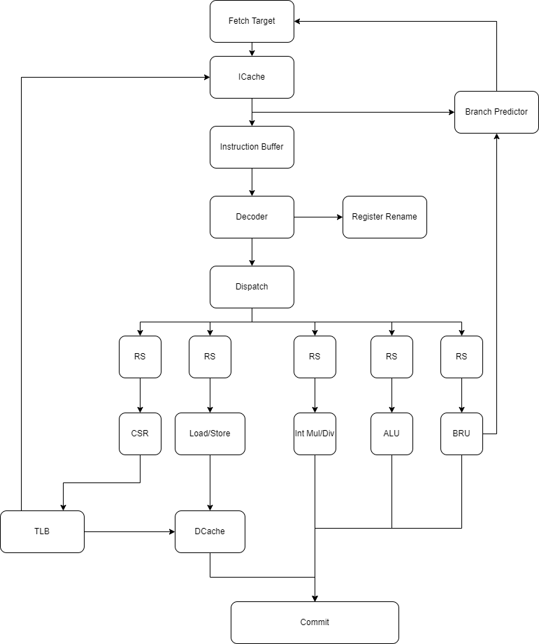

# UCAS-CA-Lab

This project implements an out-of-order CPU based on the Reduced LoongArch 32 instruction set architecture (ISA), for the UCAS course, Computer Architecture and Engineering Laboratory in 2024. 



## Directory Structure

- `myCPU/` - Contains the SystemVerilog code for the CPU.
- `soc_verify/` - Contains the files required for running the CPU in Vivado.
- `func/` - Contains test programs for validating CPU functionality.
- `gettrace/` - Contains trace for comparing during simulation.

## Usage

In Vivado Tcl Console Window, Run

```bash
source ./soc_verify/soc_axi/run_vivado/create_project.tcl
```

Then everything is in Vivado.

